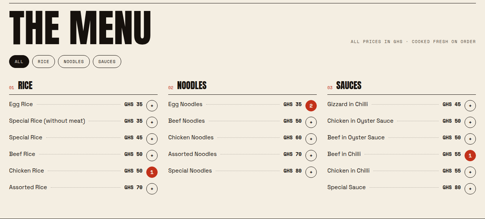
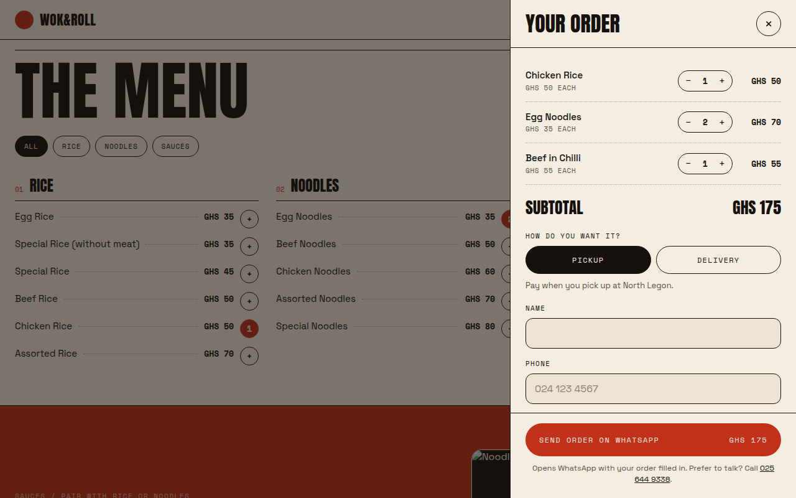
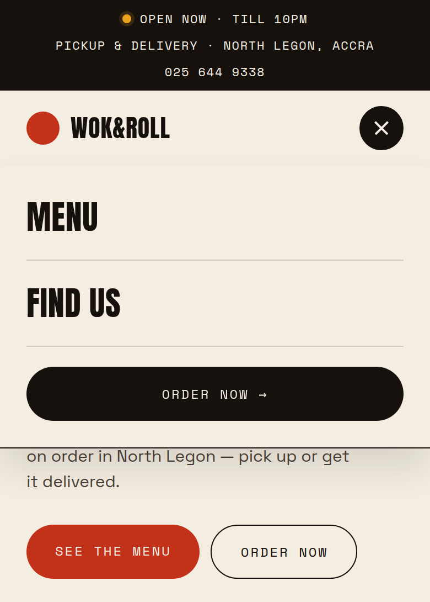
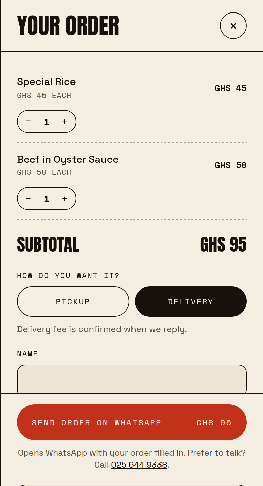

# Wok & Roll

Website for Wok & Roll, North Legon, Accra. Static HTML, CSS and vanilla JavaScript — no build step.

## Screenshots

**Menu** — category tabs, and add buttons that show how many of each item are in the order.



**Order drawer** — edit quantities, choose pickup or delivery, then send the order on WhatsApp.



**Mobile** — hamburger navigation and checkout.

<p>
  
  &nbsp;
  
</p>

## Run it

Open `index.html` in a browser, or serve the folder (recommended, so the map and fonts behave as in production):

```sh
python3 -m http.server 8000   # then visit http://localhost:8000
```

It deploys as-is to any static host (GitHub Pages, Netlify, Vercel).

## What's interactive

- **Menu** — rendered from data, filterable by category tabs (arrow keys work), with an add button per item that shows the quantity already in the order.
- **Order drawer** — floating cart bar, quantity steppers, pickup/delivery choice, validated checkout form (Ghana phone format). The cart survives page reloads.
- **Delivery location** — for delivery orders: area and house/street/landmark (required), an optional GhanaPost GPS address, and a "Share my current location" button that adds a Google Maps pin to the order. Location access needs HTTPS (fine on any real host) and the visitor's permission.
- **Payment** — delivery orders are paid upfront by MoMo (number with a copy button); pickup orders pay on collection.
- **Order hand-off** — submitting opens WhatsApp with the order pre-filled for the customer to send to 025 644 9338.
- **Open/closed badge** — live, computed on Accra time; the drawer warns if you order outside 9AM–10PM.
- **Mobile nav** — hamburger menu under 720px; the current section is highlighted as you scroll.

## Structure

```
index.html                    page markup
styles.css                    all styles (tokens → sections → components → responsive)
js/data.js                    business details + menu (single source of truth)
js/cart-store.js              cart state, localStorage persistence, subscriptions
js/order-service.js           where an order leaves the site (WhatsApp today)
js/components/nav.js          hamburger menu + active-section highlighting
js/components/open-status.js  open/closed badge
js/components/menu.js         category tabs + menu items
js/components/order.js        cart bar, drawer, checkout form, sent state
js/app.js                     wires everything together
```

## Common edits

- **Prices, items, hours, phone** — edit `js/data.js`. The static copy in `index.html` (hero labels, "The ticket" panel, find-us hours) also mentions hours and "From GHS 35", so update those too.
- **Photos** — replace the three Pexels URLs in `index.html` with your own images.

## Connecting a backend

1. **Menu from an API** — in `js/app.js`, fetch the menu before initialising components and assign it to `WR.data.menu`.
2. **Orders to a server** — replace `WR.orderService.submitOrder` in `js/order-service.js` with a `fetch("/api/orders", { method: "POST", ... })` and return `{ type: "sent" }`. The checkout UI already hides the WhatsApp instructions for that result type; the call becomes async, so `await` it in `js/components/order.js`.
